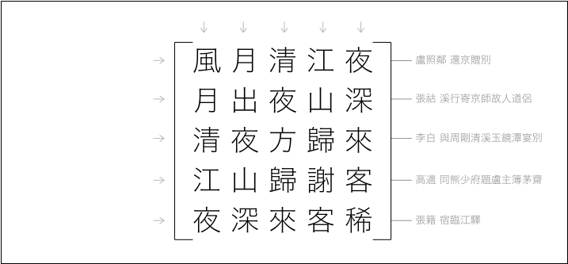

Observe the above 5x5 matrix of Chinese characters: when read horizontally, it consists of five lines from five different poems, and so does it when read vertically, of the exact same lines. I call it the magic square of Chinese poems. With a brute-force-search over 287,000 lines from the [*Complete Collection of Tang Dynasty Poems*](https://en.wikipedia.org/wiki/Quan_Tangshi), I discovered 2 such sets. You can reproduce my results by running `gcc -O3 mgsq5.c; ./a.out`.

```
風月清江夜
月出夜山深
清夜方歸來
江山歸謝客
夜深來客稀
```

諸君試觀此二十五言：縱讀之，詩五句也，橫讀之，亦此五句。各出唐人名家之手：風月清江夜，盧照鄰之詩也；月出夜山深，張祜之詩也；清夜、江山、夜深，太白、高適、張籍之詩也。余聞洛出書，有數至於九，縱橫和十五。此非詩中之洛書也歟？故名之曰：唐詩幻方。昔竇滔妻為璇璣圖，蘇伯玉妻為盤中詩。余才不及，遂書程序遍索唐人詩句而得之。反覆賞玩，以為妙絕，乃公諸此，以資眾人一笑耳。


全唐五言合二十八萬七千句，遍歷之，堪為幻方者，唯二。適其一也。其二者，輒語句平淡翻覆，興味不如也：

```
心如七十人
如何十年間
七十未成事
十年成底事
人間事事慵
```

首二句，出白樂天，以下出姚合、李昌符、李山甫。此五十字外，五言之幻方不可復得，三言之幻方乃不可勝數。聊揀其一二雅鍊者，以備一觀：

```
拂秋水
秋夜長
水長東
```

出任華、白居易、李煜也。

```
惜春心
春歌斷
心斷絕
```

出鍾輻、李珣，盧仝也。其餘錄於[是](./result3.txt)。

七言幻方尤難於五言遠甚。全唐十三萬五千六百句，未得其一焉。故為寬限，但拘四句一三五七字耳。所得遂眾。復欲擇其平仄押韻合於格律，於理通順者，則鮮矣。何耶？使二四句押韻，末句三七字必同韻，犯八病之中小韻之目矣，故唐人不多為也。

七言絕句平起首句不入韻者一：

```
長江九派人歸少
江　曲　面　年　　
九曲寒波不溯流
派　波　知　落
人面不知何處在
歸　溯　處　并
少年流落在并州
```

縱橫隔行讀之。出皇甫冉、李煜、崔護、薛能。首二句一言長江，一言黃河，似不得法。末二句方點出緣由：胡為兩地尋之而不得其人焉，蓋彼流落并州去也！亦甚滑稽堪為一笑也。


其餘雖間有堪讀者，或病折腰，或病重韻，盡錄於[此](./result7x.txt)。


余所用之程序，當以gcc編譯之如是：

```shell
gcc -O3 mgsq5.c -o mgsq5
```

復運行之，即得五言幻方焉：

```shell
./mgsq5
```

亦可與之以文本路徑、起訖行數也：

```shell
./mgsq5 5.txt 0 10000
```

七言幻方亦同：

```shell
gcc -O3 mgsq7.c -o mgsq7;
./mgsq7
```

然應無所得，蓋不存於全唐詩中也。退而求其前述寬限之格如是：

```shell
gcc -O3 mgsq7x.c -o mgsq7x;
./mgsq7x
```


初，余欲以[八后法](https://en.wikipedia.org/wiki/Eight_queens_puzzle)求唐詩幻方。然其二十五字，每字可填者五千餘，雖復以啟發法為之助，終漫漫不可期其果。細思之，何耶？剪枝苦不早也。或填前字，其於時尚可者，實暗絕後字之路，然程序渾不知，遞歸無功方還。余思治之煩甚，不若易以逐行暴力搜索也。雖云暴力，然亦預存一至四字前綴於哈希集焉。每橫取若干行，乃縱索其五列於表，不存輒立棄之。又其方陣必以對角對稱，若非，亦立棄之。旋以C語言作之，行不逾一時，遂得。

余於算法頗無用意，學詩亦未特工。故所想未必為佳，其法亦未必為速。諸公有妙思者，吾谨願聞焉。